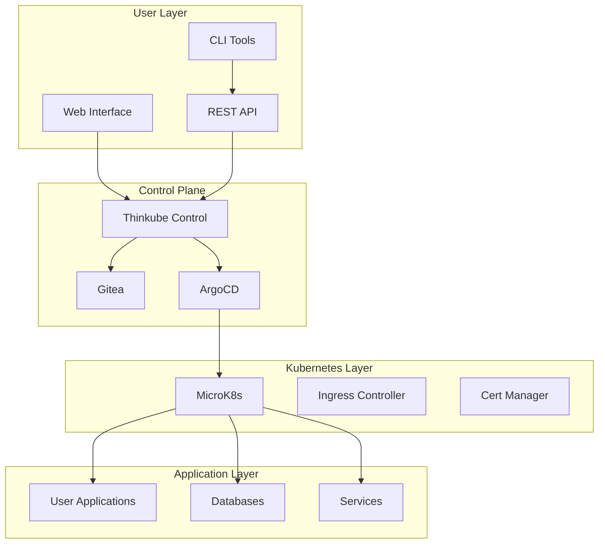

# Thinkube Architecture

Understanding how Thinkube simplifies Kubernetes deployment.

## Design Philosophy

Thinkube is built on three core principles:

1. **Simplicity First**: Hide Kubernetes complexity while maintaining its power
2. **Developer Experience**: Make deployment as easy as local development
3. **Production Ready**: Include everything needed for production out of the box

## System Architecture



## Component Layers

### 1. Infrastructure Layer
The foundation built on MicroK8s:
- Lightweight Kubernetes distribution
- Single-node or multi-node clusters
- Automatic updates and patches
- Built-in addons (DNS, storage, registry)

### 2. Platform Layer
Core Thinkube services:
- **Thinkube Control**: Central management interface
- **Gitea**: Git repository hosting
- **ArgoCD**: GitOps deployment
- **Keycloak**: Identity management

### 3. Application Layer
Your deployed applications:
- Web applications
- Databases
- AI/ML workloads
- Custom services

## Deployment Flow

1. **Define**: Create a simple `thinkube.yaml` descriptor
2. **Push**: Commit to Git repository
3. **Process**: Thinkube processes templates with your configuration
4. **Deploy**: ArgoCD deploys to Kubernetes
5. **Monitor**: Automatic monitoring and logging

## Key Concepts

### thinkube.yaml Descriptor
Simple YAML file that describes your application:
```yaml
name: my-app
type: webapp
image: myapp:latest
domain: app.example.com
resources:
  memory: 512Mi
  cpu: 500m
```

### Template System
- Pre-built templates for common applications
- Variables for customization
- Best practices built-in
- Automatic security hardening

### GitOps Workflow
- Git as single source of truth
- Automatic deployment on commit
- Rollback via Git revert
- Environment promotion

## Security Architecture

### Network Security
- Automatic TLS for all services
- Network policies by default
- Ingress rate limiting
- DDoS protection

### Access Control
- RBAC integration
- OAuth2/OIDC support
- API key management
- Audit logging

### Secret Management
- Encrypted at rest
- Automatic rotation
- Vault integration
- Environment isolation

## Storage Architecture

### Persistent Storage
- Local path provisioner
- NFS support
- Distributed storage (Longhorn)
- Backup automation

### Object Storage
- MinIO S3-compatible storage
- Multi-tenancy support
- Versioning and lifecycle
- Cross-region replication

## Networking

### Service Discovery
- Automatic DNS registration
- Service mesh ready
- Load balancing
- Health checking

### Ingress Management
- Automatic route creation
- SSL termination
- Path-based routing
- Host-based routing

## Monitoring & Observability

### Metrics
- Prometheus for metrics collection
- Grafana for visualization
- Pre-built dashboards
- Alert management

### Logging
- Centralized log aggregation
- Full-text search
- Log retention policies
- Correlation IDs

### Tracing
- Distributed tracing
- Performance profiling
- Error tracking
- Dependency mapping

## High Availability

### Control Plane HA
- Multiple control nodes
- Automatic failover
- State replication
- Zero-downtime updates

### Application HA
- Automatic pod distribution
- Rolling updates
- Health checks
- Auto-scaling

## Disaster Recovery

### Backup Strategy
- Automated backups
- Point-in-time recovery
- Off-site replication
- Tested restore procedures

### Business Continuity
- RTO < 1 hour
- RPO < 15 minutes
- Runbook automation
- Incident response

## Next Steps

- [Installation Architecture](/docs/architecture/installation)
- [Security Deep Dive](/docs/architecture/security)
- [Networking Details](/docs/architecture/networking)
- [Storage Options](/docs/architecture/storage)