## Before You Begin

Complete these steps **before** running the installer:

1. **Set up tokens** - Create accounts and tokens for:
   - [Overlay network](./overlay-network) - ZeroTier or Tailscale (your choice)
   - [Cloudflare](./cloudflare-token) - SSL certificates
   - [GitHub](./github-token) - GitOps and container registry
   - [Hugging Face](./huggingface-token) - AI model downloads

2. **Prepare your nodes** - Ensure each machine meets the [prerequisites](./node-setup) (Ubuntu 24.04, SSH, internet access). No manual bootstrap script is needed — the installer handles overlay network setup automatically.

3. **Run the installer** - Download and run the Thinkube installer desktop application (this page).

## Installation Walkthrough

### Step 1: Welcome Screen

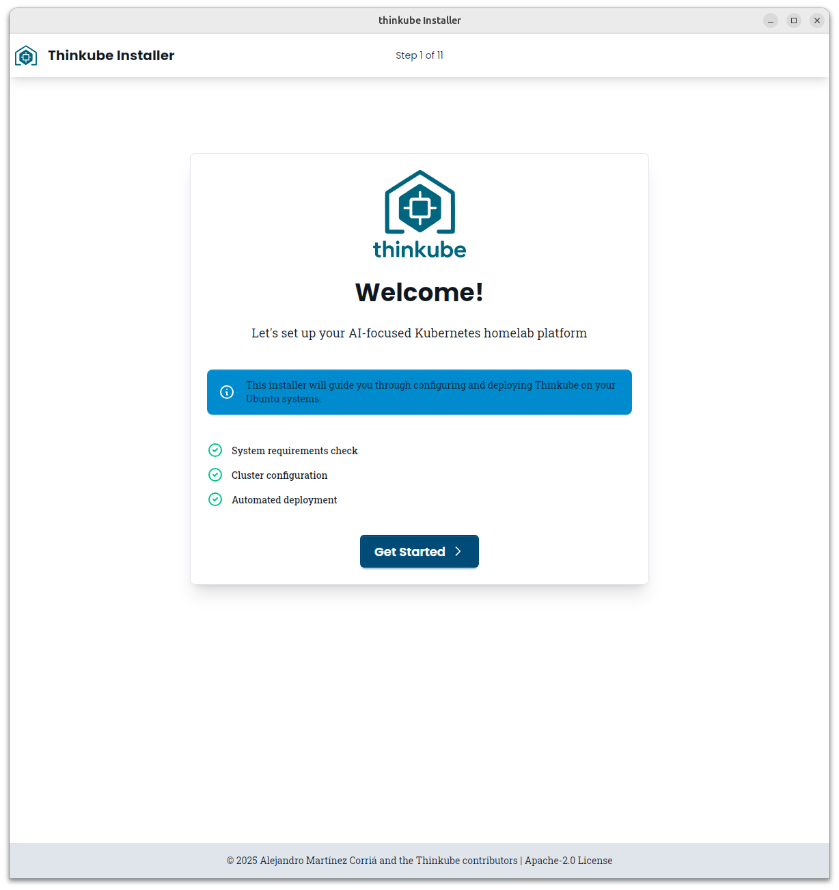

The installer welcomes you to Thinkube, your AI-focused Kubernetes homelab platform. It outlines three main phases:
- System requirements check
- Cluster configuration  
- Automated deployment

Click **Get Started** to begin.

### Step 2: System Requirements Check

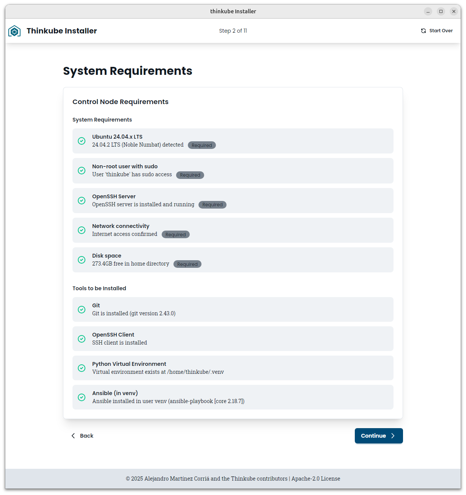

The installer automatically checks your control node for:

**Required (Must Pass):**
- Ubuntu 24.04.x LTS (Noble Numbat)
- Non-root user with sudo access
- OpenSSH Server installed and running
- Internet connectivity
- Sufficient disk space in home directory

**Tools (Will Install if Missing):**
- Git
- OpenSSH Client
- Python Virtual Environment
- Ansible (in user's venv)

Green checkmarks indicate passed requirements. The installer will offer to install any missing tools.

### Step 3: Administrator Access

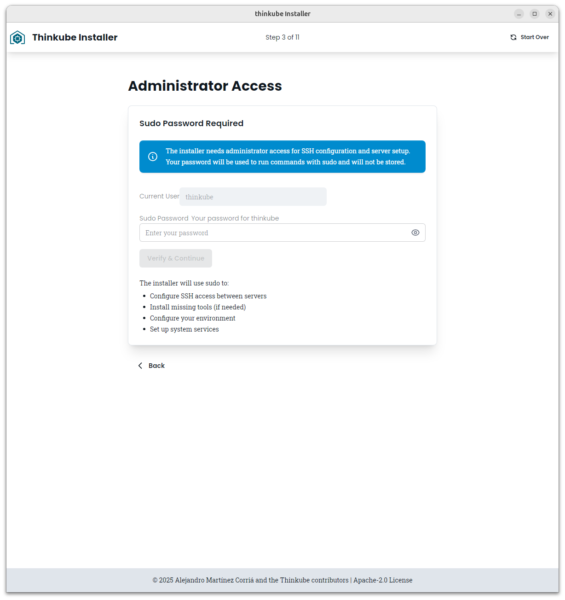

Enter your sudo password for the current user. This allows the installer to:
- Configure SSH access between servers
- Install missing tools
- Set up your environment
- Configure system services

The installer will NOT store your password.

### Step 4: Overlay Provider Selection

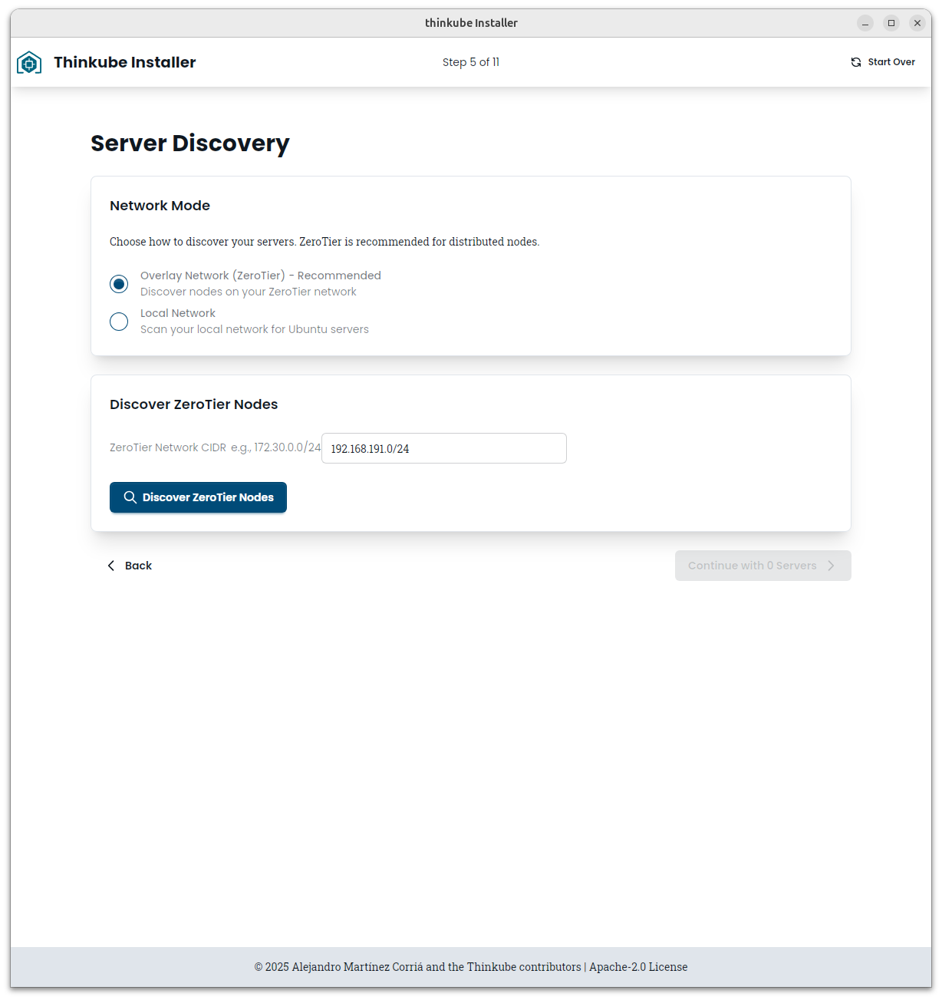

Choose your overlay network provider:

- **ZeroTier** — Software-defined networking with a virtual L2 Ethernet overlay. Uses static IPs from the network's CIDR. Free for up to 25 nodes.
- **Tailscale** — WireGuard-based mesh VPN. Auto-assigns IPs from the `100.x.x.x` range. Free for up to 100 devices.

Both providers create a secure encrypted network that makes your homelab accessible from anywhere without port forwarding.

### Why an Overlay Network

An overlay network makes your cluster location-independent:

- **Work from Anywhere**: Access your development environment from a coffee shop, office, or while traveling
- **No Port Forwarding**: No need to expose your home router to the internet
- **Encrypted**: All inter-node traffic is encrypted end-to-end
- **Simple Setup**: No complex VPN configurations or firewall rules
- **Persistent Access**: Your laptop stays connected to your homelab wherever you go

### Step 4b: Overlay Setup

After selecting your provider, the installer automatically:

1. Installs the overlay provider on all nodes
2. Joins each node to your network
3. Assigns or discovers overlay IPs
4. Verifies connectivity between all nodes

No manual node bootstrapping is required. Enter the required credentials for your chosen provider (Network ID and API token for ZeroTier, or auth key for Tailscale).

### Step 5: Server Discovery - Results

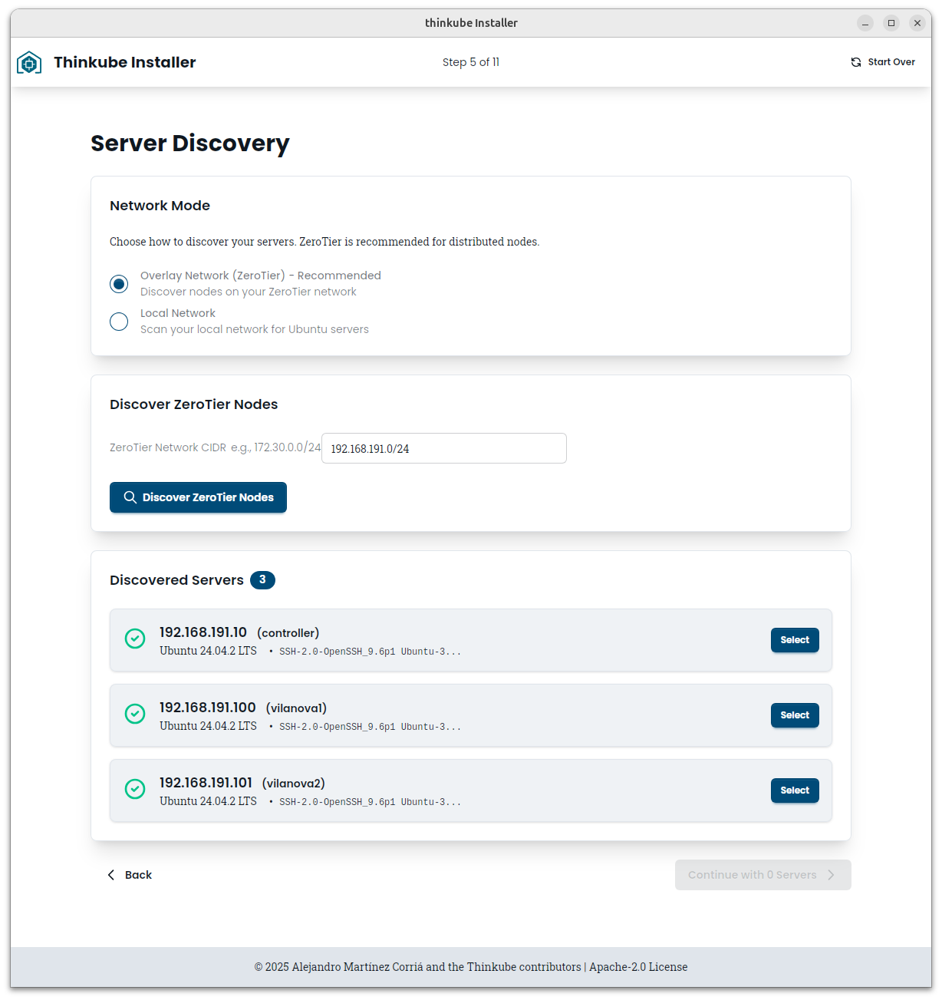

The installer shows discovered servers with:
- IP address
- Hostname (if available)
- Operating system details
- SSH status

Click **Select** to choose servers for your cluster. You can select multiple servers.

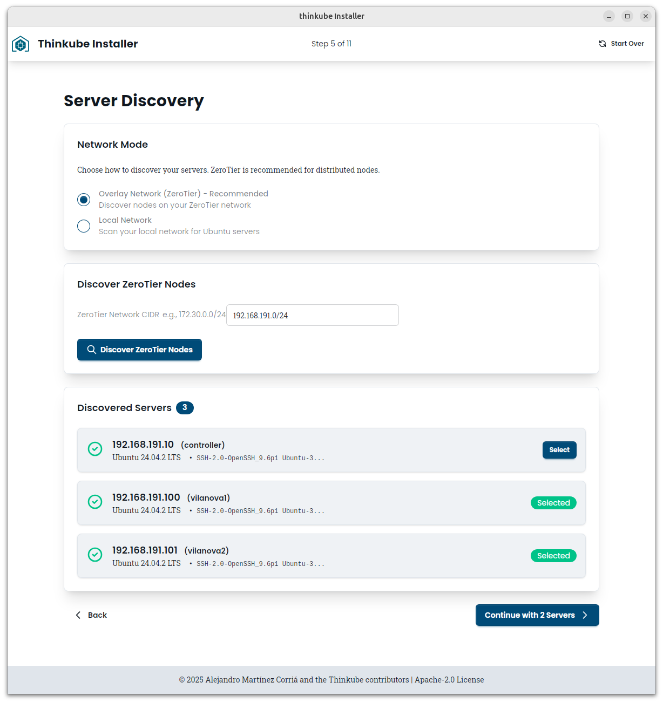

Selected servers show green "Selected" badges. Click **Continue with X Servers** when ready.

### Step 6: SSH Connectivity Check

**IMPORTANT**: Before proceeding, you must test SSH connectivity. This is a mandatory step to verify all systems are accessible before starting the Kubernetes configuration. The installer will prompt you to test connectivity to each node.

### Step 7: SSH Setup

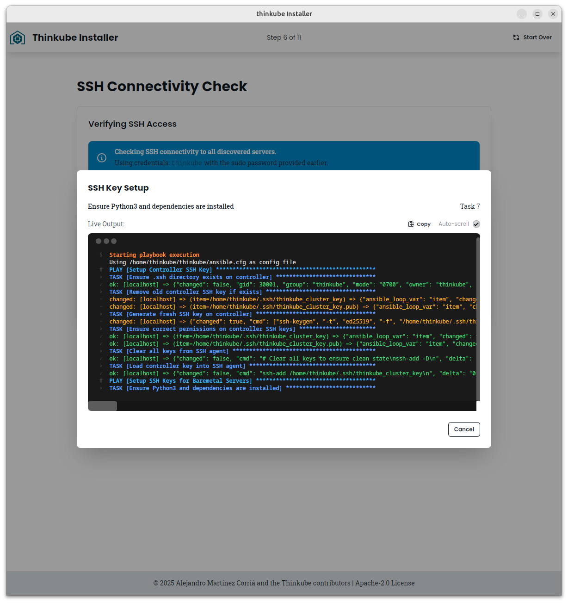

The installer configures passwordless SSH between all selected servers. A popup shows the Ansible playbook execution in real-time. This process:
- Generates SSH keys if needed
- Distributes keys between nodes
- Verifies connectivity

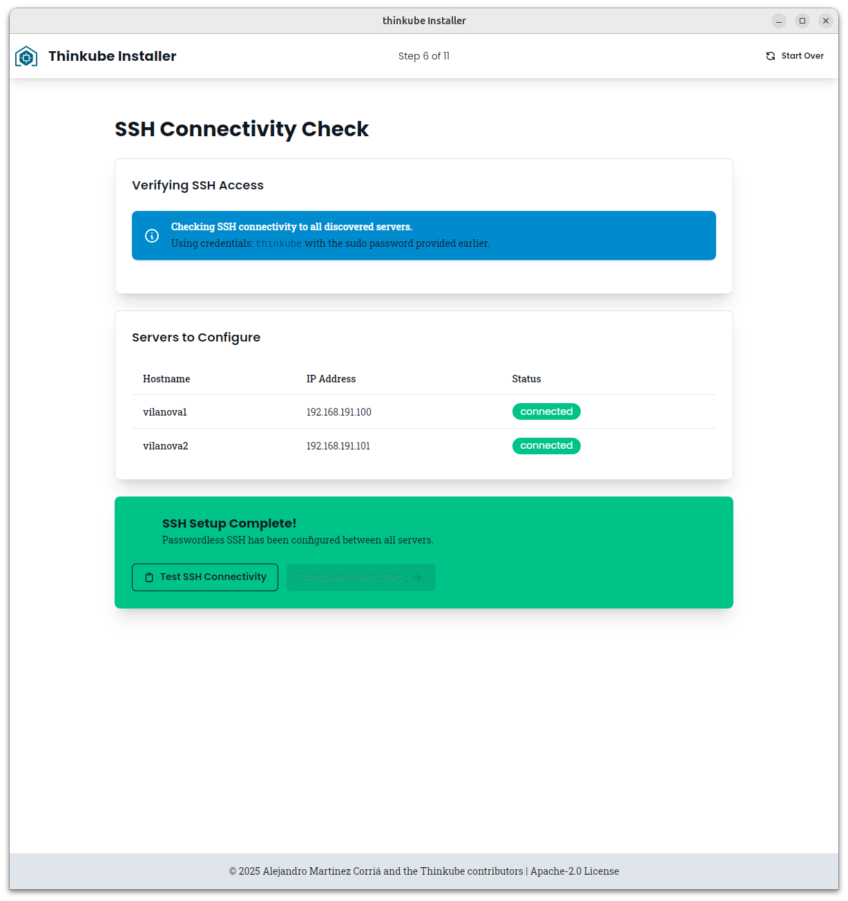

Once complete, all servers show "connected" status. The installer confirms "SSH Setup Complete!" with passwordless access configured.

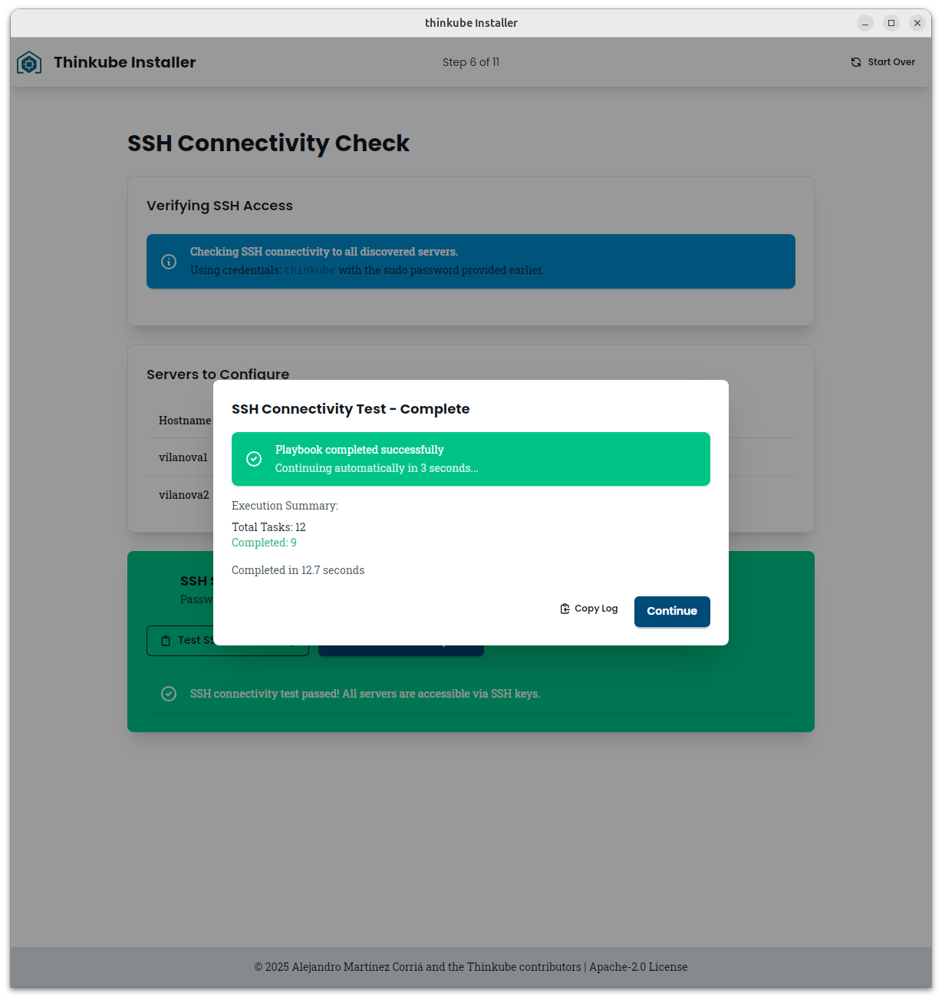

A test summary shows the number of tasks completed and execution time. Click **Continue** to proceed.

### Step 8: Hardware Detection

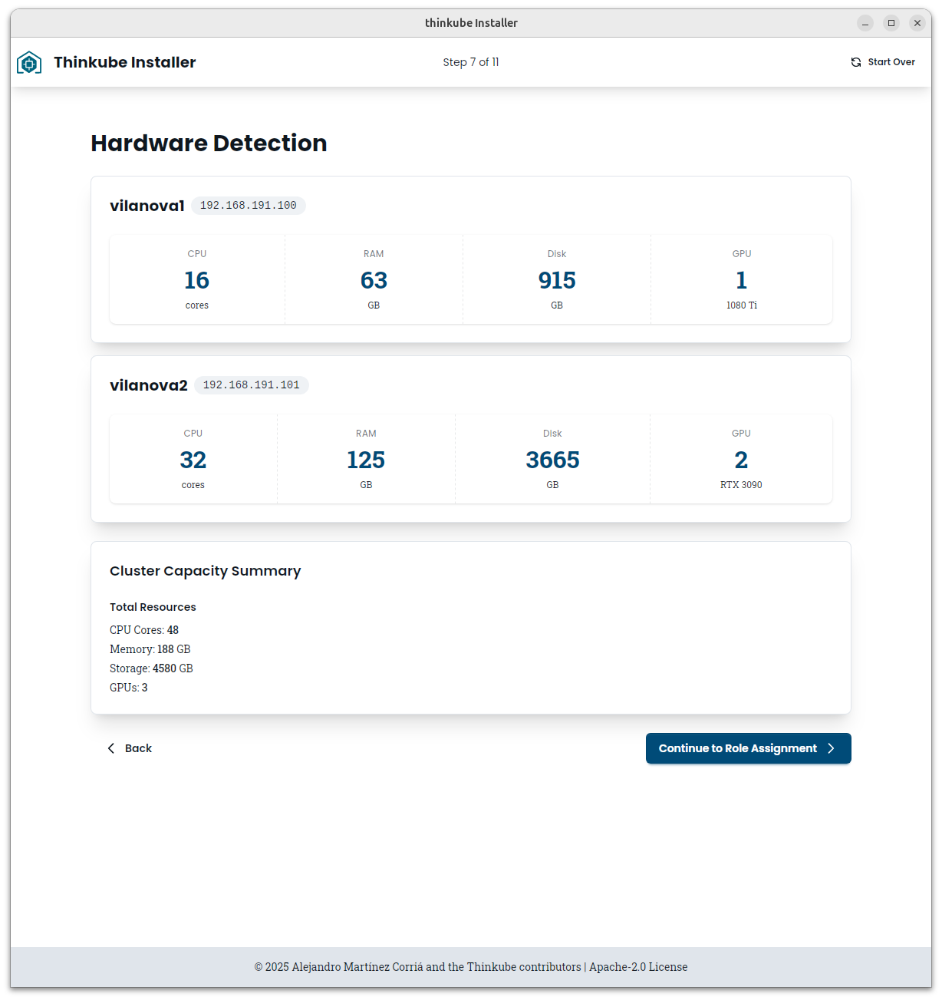

The installer detects hardware on each node, displaying:
- **CPU**: Number of cores
- **RAM**: Total memory in GB
- **Disk**: Available storage in GB
- **GPU**: Graphics cards detected (if any)

The **Cluster Capacity Summary** shows total resources across all nodes.

### Step 9: Kubernetes Role Assignment

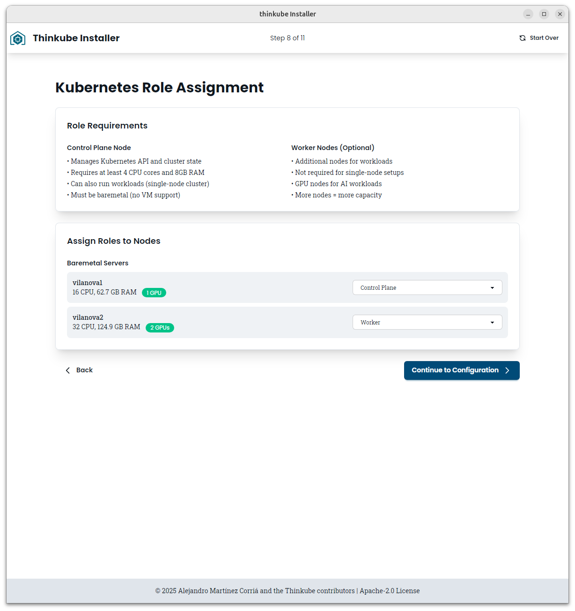

Assign roles to your servers:

**Control Plane Node:**
- Manages Kubernetes API and cluster state
- Requires minimum 4 CPU cores and 8GB RAM
- Can also run workloads in single-node setups
- Must be baremetal (no VM support)

**Worker Nodes:**
- Optional additional nodes for running workloads
- GPU-equipped nodes ideal for AI/ML tasks

The installer shows hardware specs and GPU availability for each node to help you decide.

### Step 10: Cluster Configuration

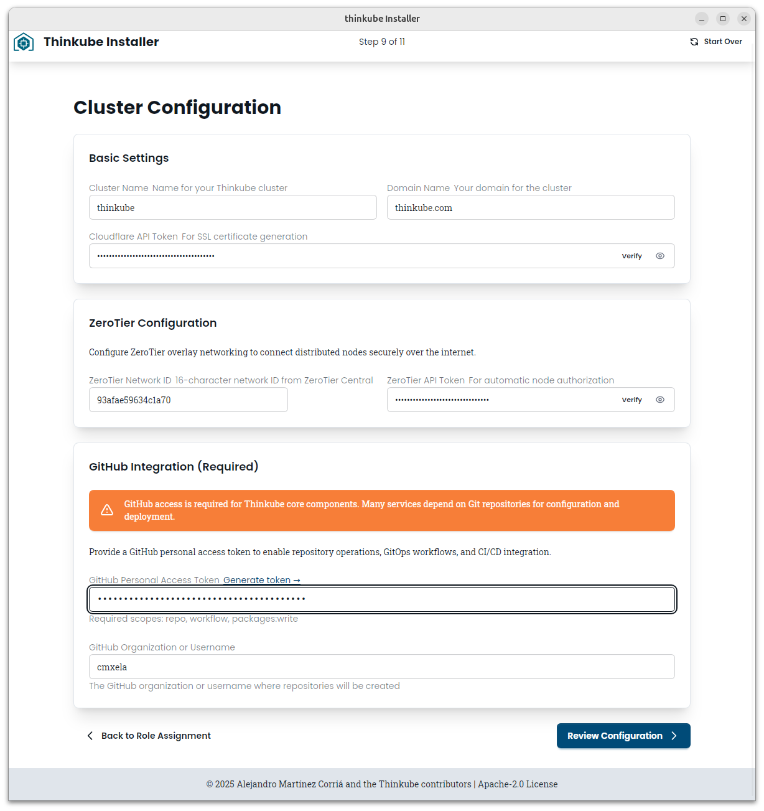

Configure your cluster settings:

**Basic Settings:**
- **Cluster Name**: A name for your Thinkube cluster
- **Domain Name**: Your domain (e.g., example.com)
- **Cloudflare API Token (REQUIRED)**: For valid SSL certificates
  - Why required: All Thinkube services need valid SSL certificates to function
  - Self-signed certificates break SSO, webhooks, and cause browser security issues
  - Uses acme.sh with DNS challenge to generate Let's Encrypt certificates
  - Certificates generated immediately during installation
  - [See Cloudflare Token Setup Guide](./cloudflare-token)

**Overlay Network Configuration:**
- For **ZeroTier**: Network ID (16-character) and API Token for automatic node authorization
- For **Tailscale**: Auth key for automatic node registration

**GitHub Integration (Required):**
- **Personal Access Token**: Powers Thinkube's GitOps workflow
  - Why required: Core to how Thinkube operates
  - Creates repositories for your application deployments
  - Manages CI/CD workflows and build pipelines
  - Provides container registry access for storing images
  - Required permissions: `repo`, `workflow`, `packages:write`
  - [See GitHub Token Setup Guide](./github-token)
- **Organization/Username**: Where deployment repositories will be created

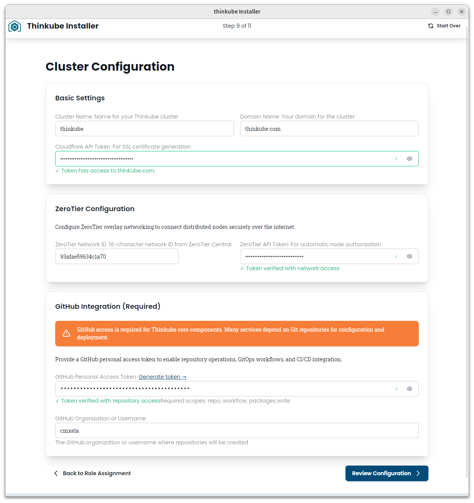

The installer validates tokens in real-time, showing green checkmarks and access confirmations.

### Step 11: Network Configuration

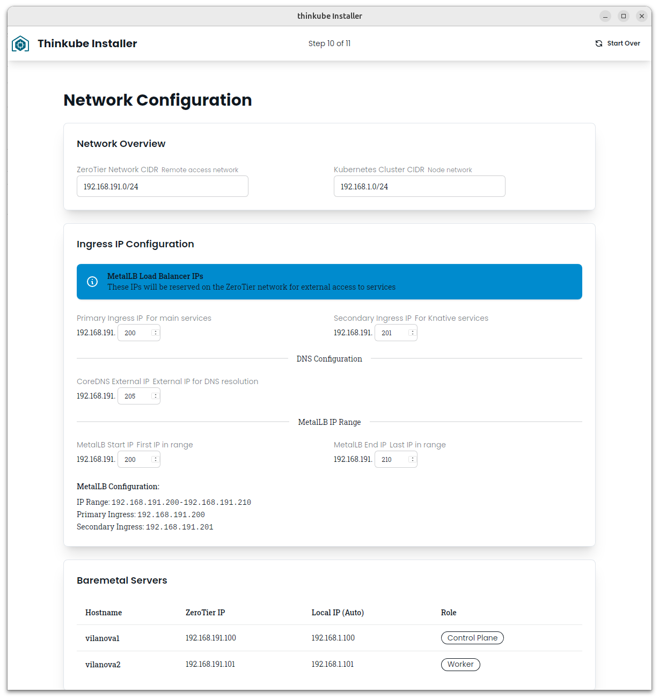

Configure advanced network settings:

**Ingress IP Configuration:**
- **Primary Ingress IP**: For main services (Control Panel, Gitea, etc.)
- **Secondary Ingress IP**: For Knative/serverless workloads

**DNS Configuration:**
- **CoreDNS External IP**: For cluster DNS resolution

**MetalLB IP Range:**
- Define a range of IPs for load balancer services

The configuration shows:
- Overlay network and Kubernetes cluster CIDRs
- IP ranges for MetalLB
- Server assignments with their IPs and roles

### Step 12: Review Configuration

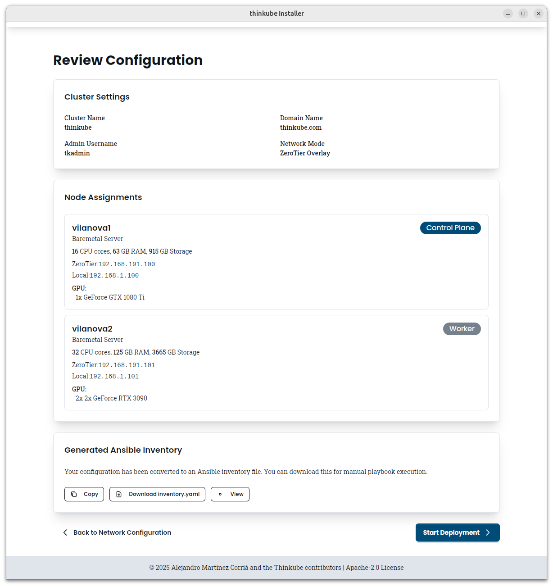

Review your complete configuration:

**Cluster Settings:**
- Cluster name and domain
- Admin username
- Network mode

**Node Assignments:**
- Each server with hardware specs
- Network addresses (overlay and local)
- Assigned roles
- GPU availability

**Generated Ansible Inventory:**
Options to copy, download, or view the generated inventory file for manual execution if needed.

Click **Start Deployment** to begin installation.

### Step 13: Deployment Progress

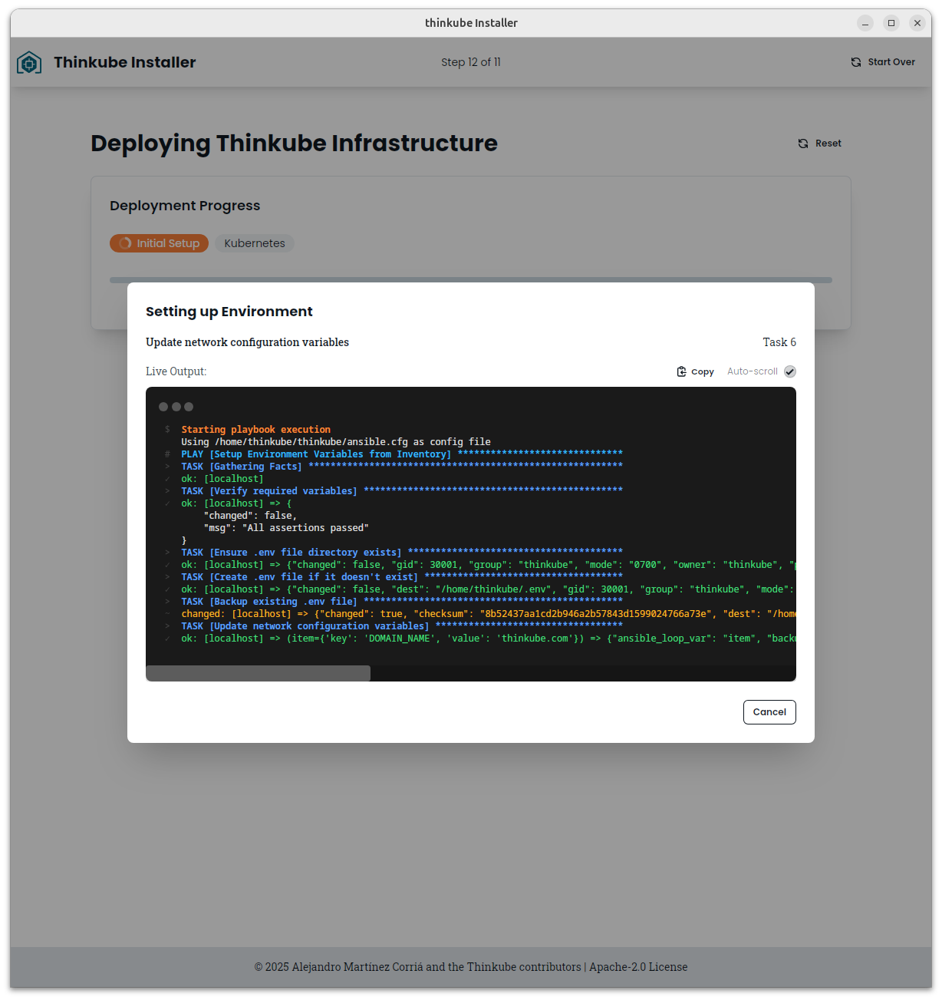

The deployment runs in phases:
1. **Initial Setup** - Environment and network configuration
2. **Kubernetes** - k8s-snap installation and cluster setup

A popup shows real-time Ansible playbook output. You can expand it to see detailed task execution.

### Step 14: Deployment Complete

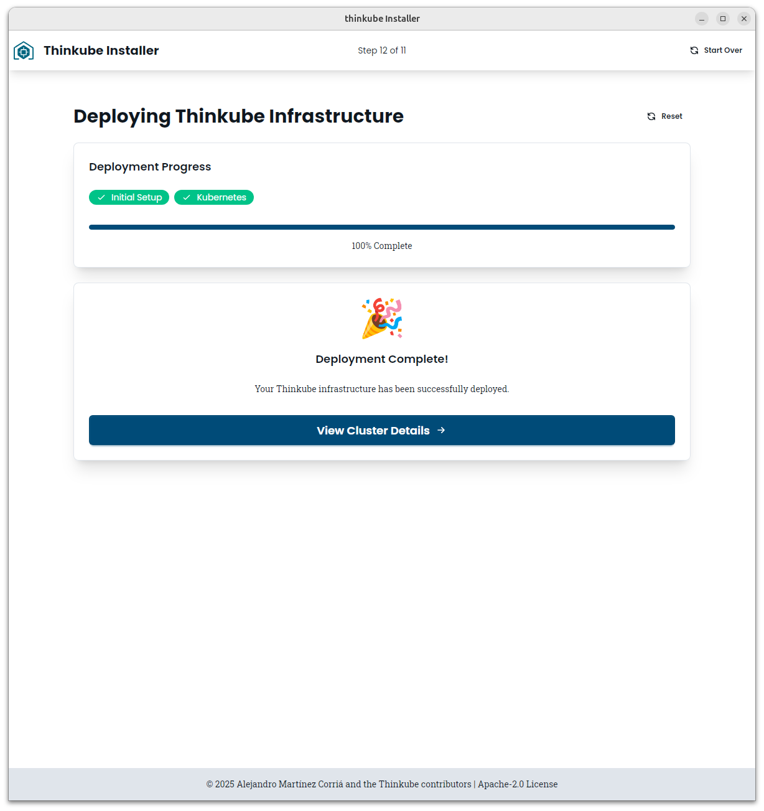

When deployment completes successfully:
- Both phases show green checkmarks
- Progress bar shows 100% complete
- Success message with celebration emoji

Click **View Cluster Details** to see your deployed services.

## What's Next?

Your Thinkube platform is now installed! You can:

1. Access the Control Panel at `https://control.<your-domain>`
2. Deploy your first application from templates
3. Access code-server at `https://code.<your-domain>` for development
4. Explore optional services installation

## Hardware Requirements

Based on the installer's hardware detection:
- **Minimum**: 4 CPU cores, 8GB RAM for control plane
- **Recommended**: 16+ cores, 64GB+ RAM for comfortable operation
- **AI Workloads**: 32+ cores, 128GB+ RAM, NVIDIA GPU with 24GB+ VRAM

## Troubleshooting

If issues occur:
1. Check the live output in installer popups for specific errors
2. Verify all requirements passed in Step 2
3. Ensure network connectivity between nodes
4. Validate GitHub and overlay network tokens
5. Check firewall rules aren't blocking required ports

## Next Steps

1. Access your Control Panel at `https://control.<your-domain>`
2. Deploy your first application from templates
3. Access code-server at `https://code.<your-domain>` for development
4. Explore optional services installation