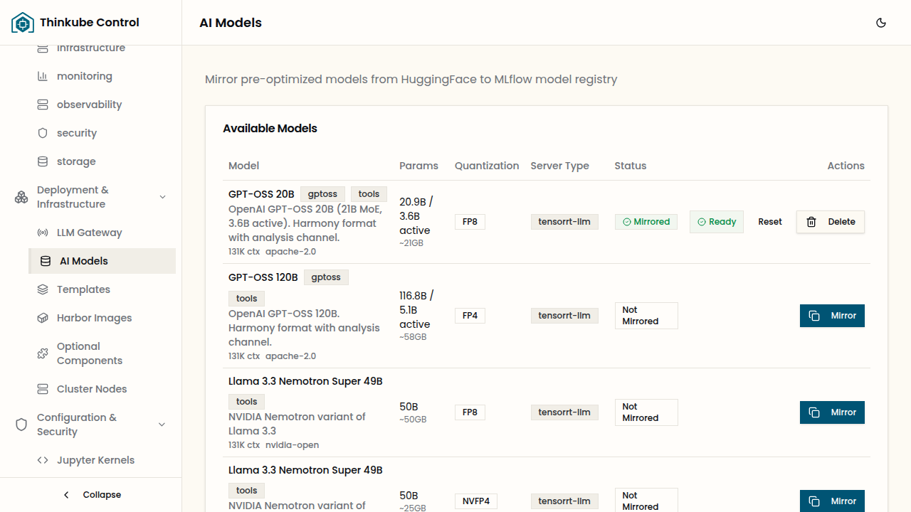
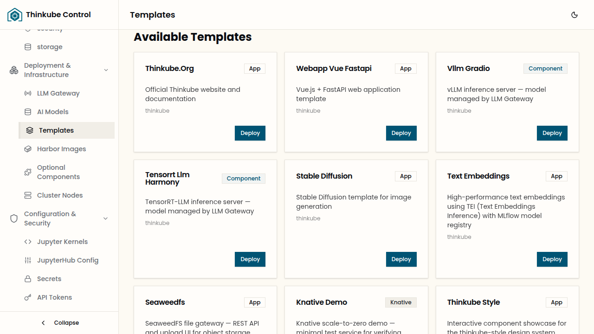
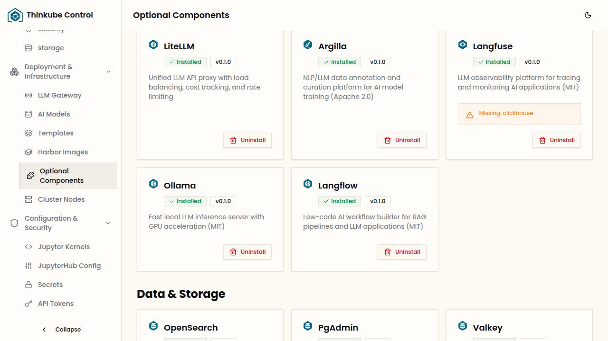
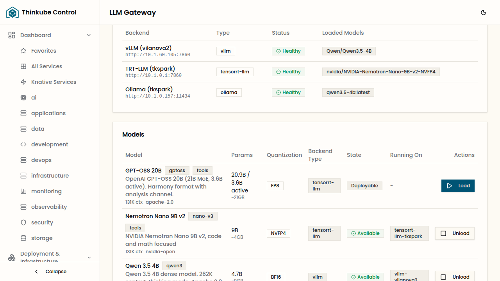
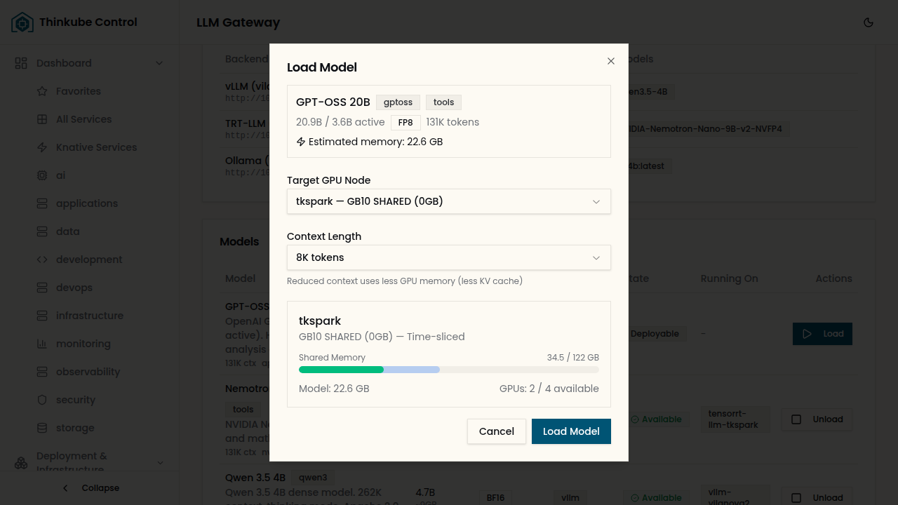
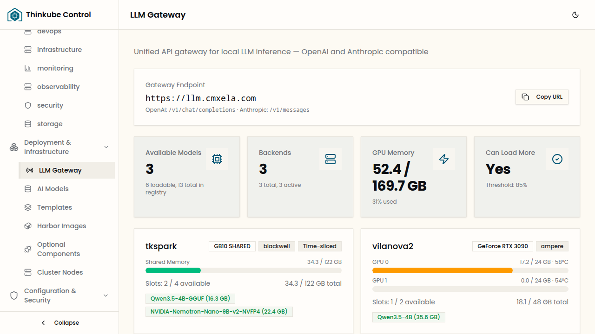
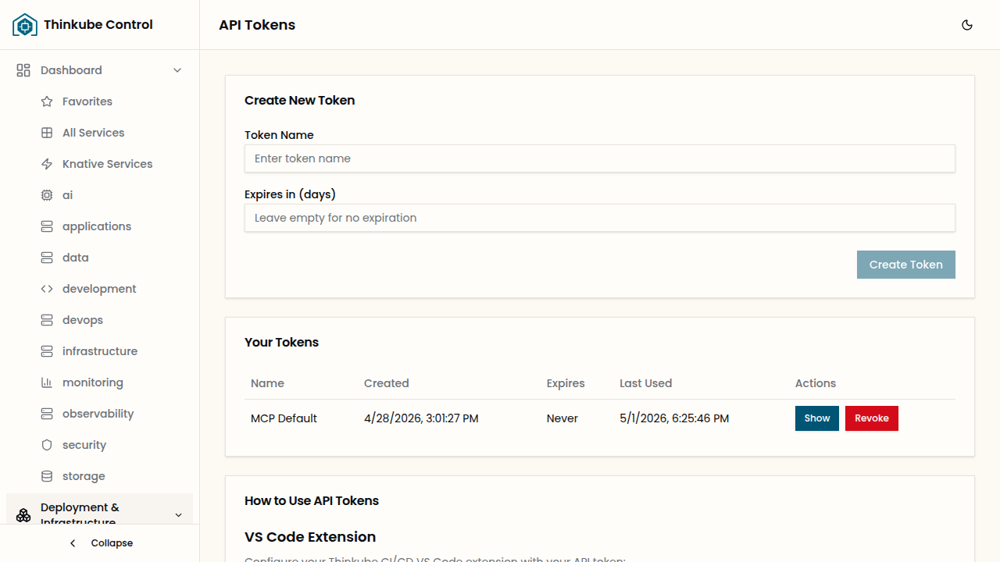

> Mirror a model, deploy an inference backend, and call your local LLM through a unified API.

## Table of Contents

- [Overview](#overview)
- [Instructions](#instructions)
- [Using the API](#using-the-api)
- [Troubleshooting](#troubleshooting)

---

## Overview

### Basic idea

Thinkube includes an **LLM Gateway** — a proxy that exposes your locally-running models through standard OpenAI and Anthropic-compatible APIs. Any tool that works with the OpenAI or Anthropic API (Claude Code, Continue, Open WebUI, LangChain, custom scripts) can point at your Thinkube instance instead.

The gateway handles model routing, authentication, and protocol translation. You deploy inference backends, mirror models to them, and the gateway makes everything available at a single endpoint.

### Architecture

```
Client (OpenAI SDK, curl, etc.)
  │
  ├─ POST /v1/chat/completions     ← OpenAI-compatible
  ├─ POST /v1/messages              ← Anthropic-compatible
  │
  ▼
LLM Gateway (llm.yourdomain.com)
  │
  ├─ Resolves model → backend
  ├─ Rewrites model names
  ├─ Translates protocols (Anthropic ↔ OpenAI)
  ├─ Normalizes reasoning/thinking content
  │
  ▼
Inference Backends
  ├─ TensorRT-LLM  (template — optimized inference)
  ├─ vLLM           (template — flexible inference)
  └─ Ollama         (optional component — lightweight)
```

### Templates vs Optional Components

Thinkube has two ways to deploy services:

| | Templates | Optional Components |
|---|-----------|-------------------|
| **What** | Applications with Thinkube-specific code (custom `server.py`, `thinkube.yaml`, CI/CD pipeline) | Upstream containers deployed as-is via Ansible |
| **Deploy via** | Thinkube Control → Templates | Thinkube Control → Optional Components |
| **Code** | Lives in a Gitea repo, built by Argo Workflows, deployed by ArgoCD | No custom code — uses the official container image |
| **Examples** | vLLM + Gradio, TensorRT-LLM + Harmony | Ollama, Qdrant, Weaviate |

For inference backends:

- **TensorRT-LLM** and **vLLM** are deployed as **templates** because they include a Thinkube wrapper (`server.py`) that adds model catalog integration, reasoning support, and Gradio UI.
- **Ollama** is deployed as an **optional component** because it runs the upstream Ollama image directly — no custom code needed.

### What you'll accomplish

- Mirror a model from HuggingFace to your local MLflow registry
- Deploy an inference backend (template or optional component)
- Load a model into GPU memory
- Get an API token
- Call the model through the LLM Gateway using both OpenAI and Anthropic APIs

### Prerequisites

- A running Thinkube installation with a GPU
- Access to Thinkube Control at `https://control.yourdomain.com`
- MLflow initialized (see [AI Models](/thinkube-control/models/))

### Time & risk

- **Duration**: 15–30 minutes (plus model download time, which varies by size)
- **Risks**: Models consume GPU memory — loading a large model can evict smaller ones
- **Rollback**: Unload the model from the AI Models page

---

## Instructions

### Step 1. Mirror a model

Before you can run a model, you need to download it from HuggingFace into your local MLflow model registry.

1. Open Thinkube Control at `https://control.yourdomain.com`
2. In the left sidebar, go to **Deployment & Infrastructure → AI Models**
3. Find the model you want in the catalog table



The catalog shows compatible inference backends in the **Server Type** column:

| Server Type | Backend | Notes |
|-------------|---------|-------|
| **tensorrt-llm** | TensorRT-LLM template | Best performance, requires pre-optimized models |
| **vllm** | vLLM template | Flexible, supports most HuggingFace models |
| **ollama** | Ollama component | Lightweight, runs GGUF quantized models |

4. Click **Mirror** to start the download
5. Monitor progress in Argo Workflows (click **Monitor**)

The model is stored in MLflow and made available on shared storage. All inference backends on all nodes can access it.

### Step 2. Deploy an inference backend

You need a running inference backend to load the model into. Choose based on the model's server type.

#### Option A: Deploy vLLM or TensorRT-LLM (template)



1. Go to **Deployment & Infrastructure → Templates**
2. Find the template:
   - **tkt-vllm-gradio** — for vLLM models
   - **tkt-tensorrt-llm-harmony** — for TensorRT-LLM models
3. Click **Deploy** and fill in the form (project name, domain)
4. Wait for the build and deployment to complete

The template creates a service at `https://yourapp.yourdomain.com` with a Gradio chat UI for interactive testing.

#### Option B: Install Ollama (optional component)



1. Go to **Deployment & Infrastructure → Optional Components**
2. Find **Ollama** in the AI & Machine Learning section
3. Click **Install**

Ollama runs as a platform service — it doesn't get its own URL. Models loaded through Ollama are accessed exclusively through the LLM Gateway.

### Step 3. Load the model

Once you have a mirrored model and a running backend:

1. Go to **Deployment & Infrastructure → LLM Gateway**
2. Scroll down to the **Models** table — mirrored models with a compatible backend show as **Deployable**



3. Click the **Load** button
4. In the load dialog:
   - Select the **backend** (e.g., `vllm-tkspark`, `ollama-tkspark`)
   - Set the **context length** (default 8192 — higher values use more GPU memory)
   - Click **Load Model**



The model loads into GPU memory. Status changes from **Deployable** → **Loading** → **Available**.

Once available, the model is registered with the LLM Gateway and ready for API calls.



### Step 4. Get an API token

The LLM Gateway uses the same authentication as the rest of Thinkube.

1. Go to **Configuration & Security → API Tokens** in Thinkube Control
2. Click **Create Token**
3. Give it a name and copy the token (starts with `tk_`)



This token works for both OpenAI and Anthropic endpoints.

---

## Using the API

The LLM Gateway is available at `https://llm.yourdomain.com`.

### OpenAI-compatible endpoint

```bash
curl https://llm.yourdomain.com/v1/chat/completions \
  -H "Content-Type: application/json" \
  -H "Authorization: Bearer tk_your_token_here" \
  -d '{
    "model": "Qwen/Qwen3.5-4B",
    "messages": [
      {"role": "user", "content": "Hello, what can you do?"}
    ],
    "temperature": 0.7,
    "max_tokens": 512
  }'
```

Response:

```json
{
  "choices": [{
    "message": {
      "role": "assistant",
      "content": "I can help you with...",
      "reasoning_content": "The user is asking about my capabilities..."
    },
    "finish_reason": "stop"
  }],
  "model": "Qwen/Qwen3.5-4B",
  "usage": {
    "prompt_tokens": 12,
    "completion_tokens": 45,
    "total_tokens": 57
  }
}
```

For models that support thinking/reasoning, the response separates `reasoning_content` (the model's internal reasoning) from `content` (the visible answer).

### Anthropic-compatible endpoint

```bash
curl https://llm.yourdomain.com/v1/messages \
  -H "Content-Type: application/json" \
  -H "x-api-key: tk_your_token_here" \
  -H "anthropic-version: 2023-06-01" \
  -d '{
    "model": "Qwen/Qwen3.5-4B",
    "messages": [
      {"role": "user", "content": "Hello, what can you do?"}
    ],
    "max_tokens": 512
  }'
```

Response:

```json
{
  "id": "msg_abc123",
  "type": "message",
  "role": "assistant",
  "content": [
    {
      "type": "thinking",
      "thinking": "The user is asking about my capabilities..."
    },
    {
      "type": "text",
      "text": "I can help you with..."
    }
  ],
  "model": "Qwen/Qwen3.5-4B",
  "stop_reason": "end_turn",
  "usage": {
    "input_tokens": 12,
    "output_tokens": 45
  }
}
```

The Anthropic endpoint translates requests to OpenAI format internally, forwards them to the backend, and translates responses back. Thinking models return a `thinking` content block before the `text` block.

### List available models

```bash
curl https://llm.yourdomain.com/v1/models \
  -H "Authorization: Bearer tk_your_token_here"
```

Returns all loaded models in OpenAI model list format.

### Model names

Use the model ID from the catalog (e.g., `Qwen/Qwen3.5-4B`, `nvidia/NVIDIA-Nemotron-Nano-9B-v2-NVFP4`). The gateway resolves the ID to the correct backend and translates it to the backend's internal name automatically.

### Using with SDKs

The gateway works with any OpenAI or Anthropic SDK:

**Python (OpenAI SDK)**

```python
from openai import OpenAI

client = OpenAI(
    base_url="https://llm.yourdomain.com/v1",
    api_key="tk_your_token_here",
)

response = client.chat.completions.create(
    model="Qwen/Qwen3.5-4B",
    messages=[{"role": "user", "content": "Hello!"}],
    max_tokens=512,
)
print(response.choices[0].message.content)
```

**Python (Anthropic SDK)**

```python
import anthropic

client = anthropic.Anthropic(
    base_url="https://llm.yourdomain.com",
    api_key="tk_your_token_here",
)

message = client.messages.create(
    model="Qwen/Qwen3.5-4B",
    max_tokens=512,
    messages=[{"role": "user", "content": "Hello!"}],
)
print(message.content[0].text)
```

### Streaming

Both endpoints support streaming. Add `"stream": true` to the request body:

- **OpenAI**: Returns `text/event-stream` with `data: {...}` chunks
- **Anthropic**: Returns `text/event-stream` with Anthropic SSE events (`message_start`, `content_block_delta`, `message_stop`)

---

## Troubleshooting

### Model not found

If the gateway returns `"Model not found or not available"`:

- Check the model is loaded (status **Available** in AI Models page)
- Use the exact model ID from the catalog, not the backend's internal name
- If you just loaded the model, wait a few seconds for the gateway to pick it up

### Loading fails with GPU memory error

The model requires more GPU memory than available. Either:

- Reduce the context length in the load dialog
- Unload another model first to free GPU memory
- Use a smaller quantization (e.g., GGUF Q4_K_M via Ollama instead of BF16 via vLLM)

### Reasoning content missing

For thinking models (Qwen3, Nemotron, DeepSeek):

- **TensorRT-LLM and vLLM**: Always separate reasoning from content
- **Ollama (GGUF)**: May intermittently skip reasoning on simple prompts due to quantization artifacts. This is a known limitation of heavily quantized GGUF models.

### Authentication error

- Verify your token starts with `tk_`
- OpenAI endpoint: use `Authorization: Bearer tk_...`
- Anthropic endpoint: use `x-api-key: tk_...`
- Tokens expire — create a new one from Settings → API Tokens if needed

---

## Next steps

- **[AI Models](/thinkube-control/models/)** — Full reference for the model catalog and mirroring
- **[Optional Components](/thinkube-control/components/)** — Install Ollama, vector databases, and more
- **[Templates](/thinkube-control/templates/)** — Deploy vLLM, TensorRT-LLM, and other services
