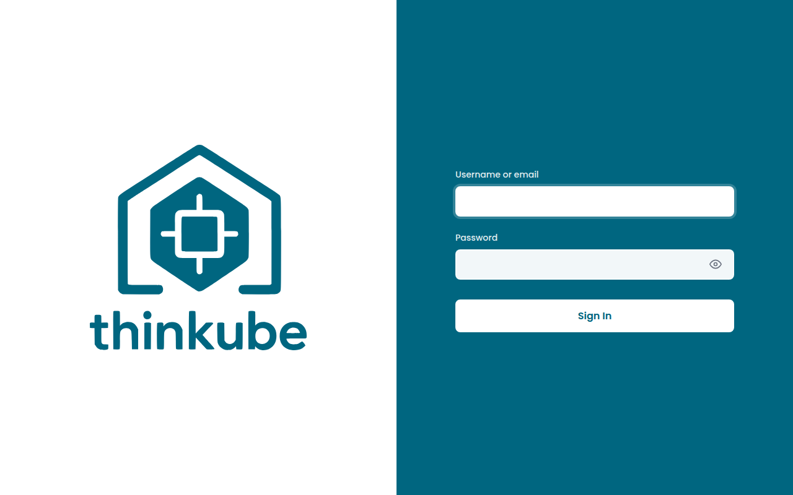
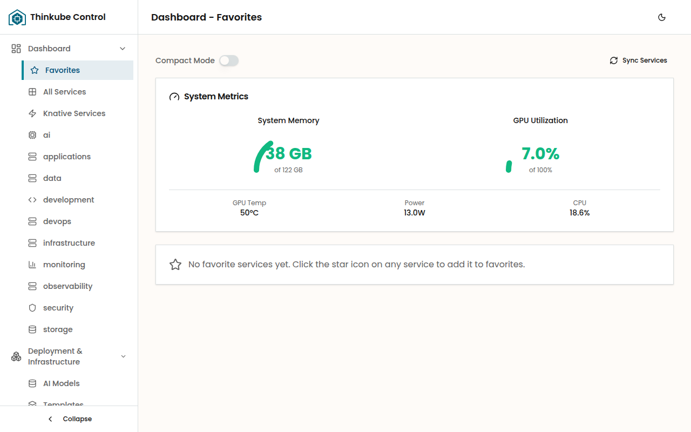
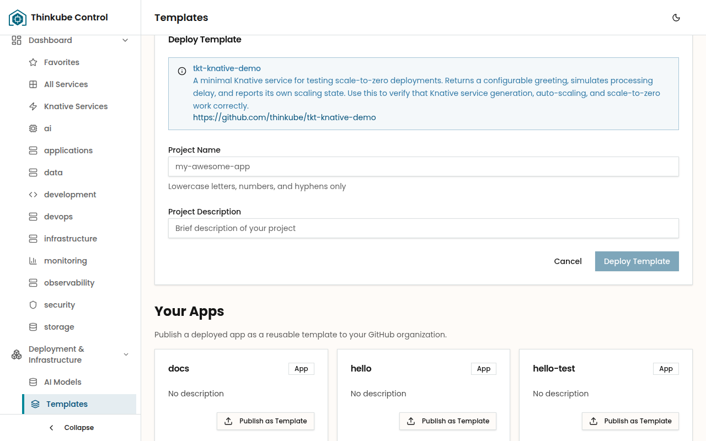
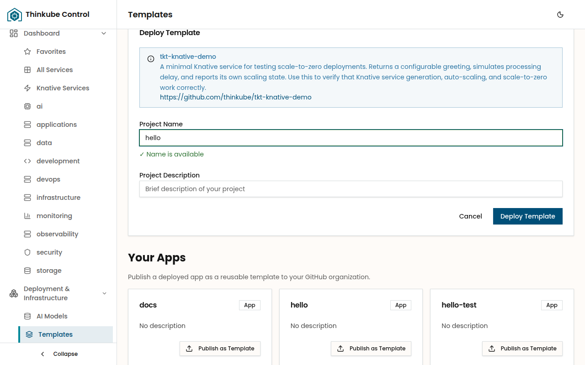
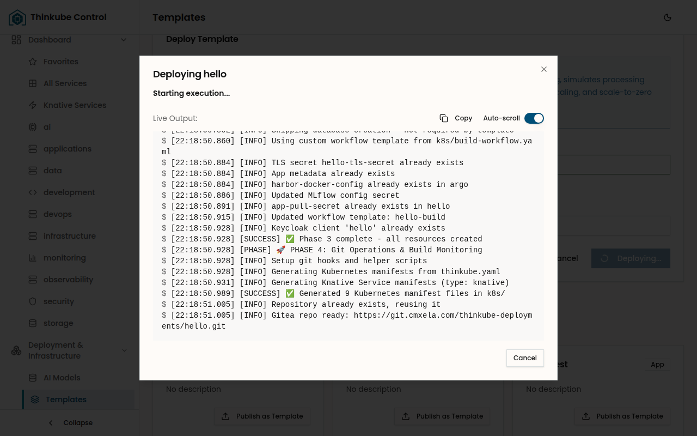
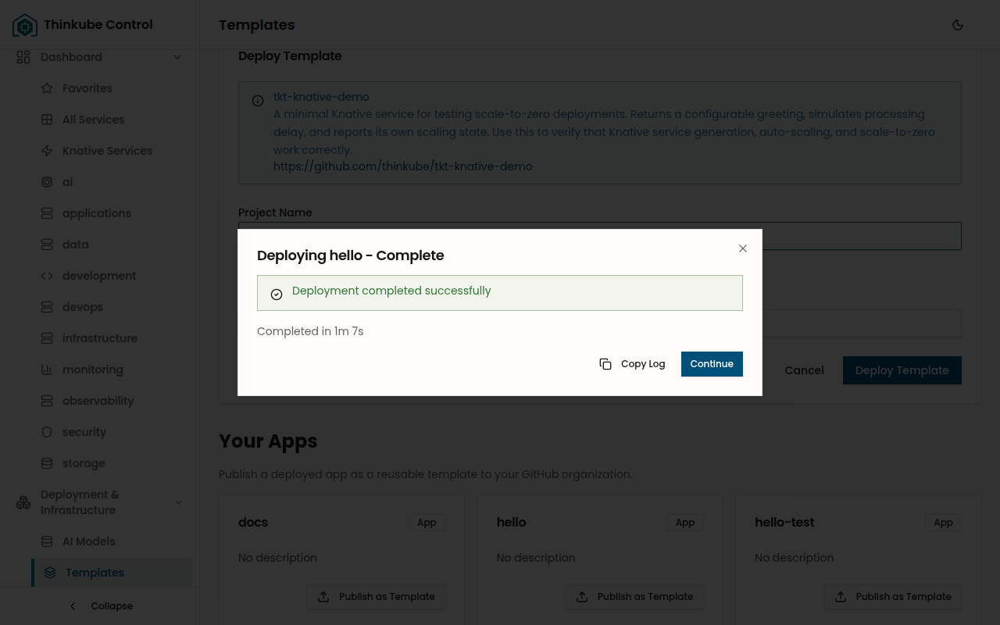
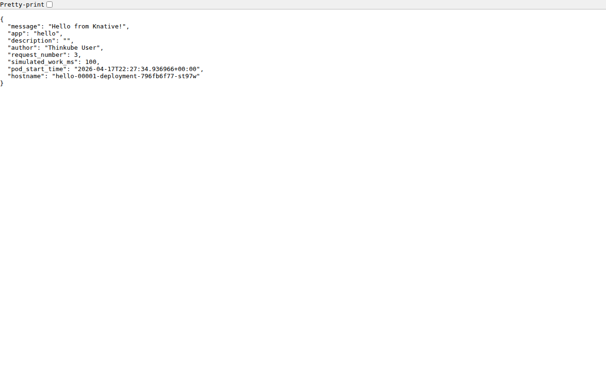
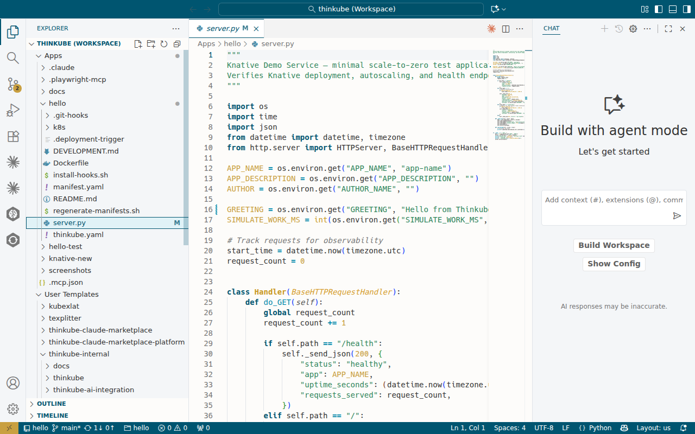

> Deploy a service, edit the code, push a change, and watch it go live.

## Table of Contents

- [Overview](#overview)
- [Instructions](#instructions)
- [Troubleshooting](#troubleshooting)

---

## Overview

### Basic idea

This playbook walks you through the complete Thinkube development cycle: deploy a template, edit the code in your browser, push a change, and see it go live automatically. By the end you'll understand how every application on the platform works — from first deploy to ongoing development.

We'll use the **Knative Demo** template — a minimal Python service that scales to zero when idle and wakes up on the first request. It's the simplest template on the platform, which makes it perfect for learning the workflow.

### What you'll accomplish

- Deploy a Knative service from a platform template
- Open the running service in your browser
- Edit the source code in Code Server
- Commit and push — triggering an automatic rebuild and redeploy
- See your change live without touching any infrastructure

### Prerequisites

- A running Thinkube installation
- Access to Thinkube Control at `https://control.yourdomain.com`
- Access to Code Server at `https://code.yourdomain.com`

### Time & risk

- **Duration**: 10–15 minutes (plus 2–5 minutes for the initial build)
- **Risks**: None — this deploys an isolated service with no external dependencies
- **Rollback**: Delete the deployment from Thinkube Control

---

## Instructions

### Step 1. Open Thinkube Control

Go to `https://control.yourdomain.com`. You'll be redirected to the Keycloak login page.



Log in with your Thinkube credentials. After authentication, you'll see the dashboard with system metrics and your favorite services.



### Step 2. Navigate to Templates

In the left sidebar, expand **Deployment & Infrastructure** and click **Templates**.

You'll see three sections:
- **Deploy from GitHub** — for deploying any template by URL
- **Your Apps** — apps you've already deployed
- **Available Templates** — pre-configured templates ready to deploy

### Step 3. Deploy the Knative Demo

Find **Knative Demo** in the Available Templates section and click **Deploy**.

The deploy form appears at the top of the page:



Fill in the form:

| Field | Value | Notes |
|-------|-------|-------|
| **Project Name** | `hello` | This becomes your subdomain: `hello.yourdomain.com` |

The form validates your project name in real time — you'll see a green "Name is available" message when it's valid.



Click **Deploy Template**.

### Step 4. Watch the deployment

A dialog shows the deployment progress in real time. You can see each phase as it completes:



Thinkube now:
1. Copies the template code to your local workspace
2. Pushes it to Gitea (your self-hosted Git server)
3. Triggers an Argo Workflow that builds the container image with Kaniko
4. Pushes the image to your Harbor registry
5. Harbor fires a webhook that triggers ArgoCD to sync the Knative service

The initial deployment takes about 1 minute. Once it finishes, you'll see a success message:



Click **Continue** to return to the templates page.

### Step 5. Open your service

Once the build completes (typically 1–3 minutes after deployment), open:

```
https://hello.yourdomain.com
```

You'll see a JSON response:



```json
{
  "message": "Hello from Knative!",
  "app": "hello",
  "request_number": 1,
  "simulated_work_ms": 100,
  "hostname": "hello-00001-deployment-..."
}
```

That's your service running on the platform. Because it's a Knative service, it scales to zero after 30 seconds of inactivity — and wakes up on the next request.

### Step 6. Open the code in Code Server

Go to `https://code.yourdomain.com`. This is VS Code running in your browser.

In the file explorer, navigate to **Apps > hello** and open `server.py`:


You'll see the project files:

```
hello/
├── .git-hooks/
├── k8s/
├── Dockerfile
├── server.py
├── thinkube.yaml
├── manifest.yaml
└── DEVELOPMENT.md
```

### Step 7. Make a change

Find the `GREETING` default value near the top of `server.py`:

```python
GREETING = os.environ.get("GREETING", "Hello from Knative!")
```

Change it to something else:

```python
GREETING = os.environ.get("GREETING", "Hello from Thinkube! My first deploy.")
```

Save the file.



### Step 8. Commit and push

Open the terminal in Code Server (`` Ctrl+` ``) and run:

```bash
cd /home/thinkube/apps/hello
git add server.py
git commit -m "Update greeting message"
git push
```

That push to Gitea triggers the CI/CD pipeline automatically. You don't need to do anything else.

### Step 9. Wait for the rebuild

The push triggered the CI/CD pipeline. The build runs in the background — typically 1–3 minutes for subsequent builds (faster than the first). Give it a couple of minutes.

### Step 10. See your change live

Refresh `https://hello.yourdomain.com`:

```json
{
  "message": "Hello from Thinkube! My first deploy.",
  "app": "hello",
  "request_number": 1,
  ...
}
```

Your change is live. That's the cycle: **edit → commit → push → live**.

Every application on Thinkube works this way. Templates give you a starting point, and from there it's just normal development — edit code, push, and the platform handles the rest.

---

## What just happened

Here's what the platform did behind the scenes:

```
You pushed to Gitea
  → Gitea webhook fires
    → Argo Workflow starts
      → Kaniko builds your Docker image
        → Image pushed to Harbor registry
          → Harbor webhook triggers ArgoCD sync
            → Knative service updated
              → Your change is live
```

You didn't configure any of this. The template deployment set it all up automatically.

---

## Troubleshooting

### Build fails

Check the Argo Workflows UI at `https://argo.yourdomain.com` to see build logs. Common causes:

- **Syntax error in code**: Fix the error, commit, and push again
- **Dockerfile issue**: Make sure you haven't accidentally modified the Dockerfile in a way that breaks the build

### Service not responding

Knative services scale to zero after idle time. The first request after scaling down takes a few seconds (cold start). If the service doesn't respond at all:

```bash
kubectl get ksvc -n hello
```

Check that the service exists and has a `READY` status of `True`.

### Changes not appearing after push

Verify the push triggered a build:

1. Check Argo Workflows at `https://argo.yourdomain.com` for a new workflow
2. If no build appeared, check that you pushed to the correct remote (`git remote -v` should show your Gitea URL)

---

## Next steps

- **[Deploy a Web App](/learn/web-apps/)** — Try the Vue + FastAPI template for a full-stack application with a database
- **[Learn about thinkube.yaml](/thinkube-control/spec-thinkube-yaml/)** — Understand the deployment descriptor that makes this all work
- **[Creating Templates](/thinkube-control/creating-templates/)** — Turn your own applications into reusable templates
